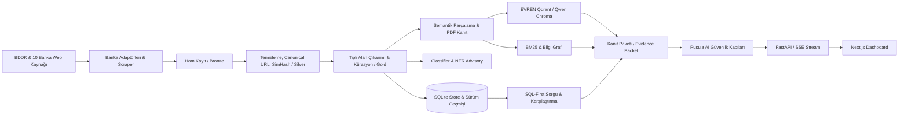
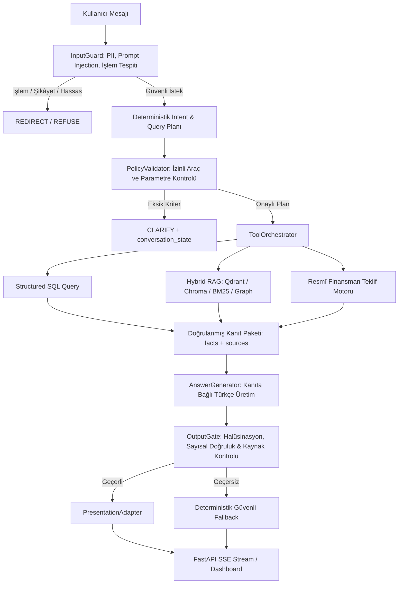

# RAGnROLL Katılım Bankacılığı NLP Platformu

## Final Proje ve Sunum Raporu

> **İncelenen sürüm:** `origin/main` — `6b75777f17907fc988a483a593f1704ea8920976` (PR #51)  
> **Son commit tarihi:** 28 Ağustos 2026  
> **Rapor tarihi:** 28 Ağustos 2026  
> **Lisans:** Apache License 2.0  
> **Depo:** `rag-n-roll/RAGnROLL-katilim-bankaciligi-nlp`

Bu belge, GitHub deposundaki güncel kaynak kodlar, veri dosyaları, model artefaktları,
manifestler, API sözleşmeleri, Next.js dashboard'u, kapsamlı test paketleri (backend ve frontend),
CI iş akışları ve teknik mimari belgeleri birlikte incelenerek hazırlanmıştır. Amaç yalnızca
sistemi tanıtmak değil; projenin hangi problemi çözdüğünü, nasıl çalıştığını, hangi kanıtlara
dayandığını, hangi sınırlar içinde güvenilir olduğunu ve canlı sunumda nasıl
gösterilebileceğini eksiksiz ve doğrulanabilir biçimde açıklamaktır.

---

## İçindekiler

| Bölüm | Başlık |
| ---: | --- |
| 1 | [Yönetici özeti](#1-yönetici-özeti) |
| 2 | [Problem ve ihtiyaç](#2-problem-ve-ihtiyaç) |
| 3 | [Amaçlar ve başarı ölçütleri](#3-amaçlar-ve-başarı-ölçütleri) |
| 4 | [Kapsam](#4-kapsam) |
| 5 | [Çözüm yaklaşımı](#5-çözüm-yaklaşımı) |
| 6 | [Sistem mimarisi](#6-sistem-mimarisi) |
| 7 | [Veri ve yapay zekâ hattı](#7-veri-ve-yapay-zekâ-hattı) |
| 8 | [Pusula AI güvenlikli asistan mimarisi](#8-pusula-ai-güvenlikli-asistan-mimarisi) |
| 9 | [Teknoloji yığını](#9-teknoloji-yığını) |
| 10 | [Temel ürün yetenekleri ve API](#10-temel-ürün-yetenekleri-ve-api) |
| 11 | [Kalite güvence, test ve değerlendirme](#11-kalite-güvence-test-ve-değerlendirme) |
| 12 | [Depo yapısı ve teknik kaynaklar](#12-depo-yapısı-ve-teknik-kaynaklar) |
| 13 | [Kurulum, çalıştırma ve operasyon](#13-kurulum-çalıştırma-ve-operasyon) |
| 14 | [Güvenlik, gizlilik ve etik ilkeler](#14-güvenlik-gizlilik-ve-etik-ilkeler) |
| 15 | [Sınırlılıklar ve riskler](#15-sınırlılıklar-ve-riskler) |
| 16 | [Yol haritası](#16-yol-haritası) |

---

## 1. Yönetici özeti

RAGnROLL, Türkiye'deki 10 resmî katılım bankasının güncel ürün, kampanya ve faizsiz
finansman içeriklerini tek bir doğrulanabilir bilgi platformunda birleştiren, katılım
bankacılığına özel bir veri ve yapay zekâ sistemidir. Platform; web verisi toplama,
veri temizleme, tipli alan çıkarımı, çok etiketli sınıflandırma, Türkçe NER, katılım
finans ontolojisi, bilgi grafı, hibrit RAG (vektör + BM25 + graf füzyonu), resmî
finansman hesaplayıcısı, kanıt temelli sohbet ve interaktif Next.js dashboard
bileşenlerini uçtan uca bütünleştirir.

Projenin ayırt edici temel prensibi, **bir büyük dil modelinin (LLM) serbestçe finansal gerçek
ya da sayısal oran üretmesine izin vermemesidir**. Sayısal veriler, kâr payı oranları,
vade limitleri ve karşılaştırma kriterleri yapılandırılmış veritabanından (`SQLite`),
resmî banka teklif motorundan veya doğrulanmış PDF kanıt paketlerinden temin edilir.
Model yalnızca bu doğrulanmış `facts` ve `sources` paketini akıcı ve anlaşılır Türkçe ile
kullanıcıya sunma rolünü üstlenir. Model veya uzak servisler erişilemez olsa dahi
deterministik kural ve şablon tabanlı cevap yolu kesintisiz çalışmayı sürdürür.

### Ürün değeri

- **10 bankanın tamamı:** BDDK kataloğundaki 10 katılım bankasının dağınık resmî içeriklerini ortak veri sözleşmesine dönüştürür.
- **Doğrulanmış ve kürasyonlu katalog:** Ham 476 kaydın taranmasının ardından, ürün kanıtı taşımayan belirsiz kayıtlar ayıklanarak 454 yüksek güvenilirlikli aktif kampanya/ürün kataloğu sunulur.
- **Tipli eksiklik yönetimi:** Kaynakta belirtilmeyen alanları uydurmak yerine `NOT_STATED` / `NOT_APPLICABLE` gibi tipli durumlarla korur.
- **Açıklanabilir finansman karşılaştırması:** Finansman tekliflerini tutar, vade ve masraf önceliği gibi şeffaf ölçütlere bağlar; öznel "en iyi" iddialarından kaçınır.
- **Uçtan uca kanıt kökeni:** Her cevabın kaynağını, URL'sini, yayıncısını veya PDF sayfa numarasını kullanıcıya görünür kılar.
- **Güvenli sınırlandırma:** İşlem yapma, şikâyet oluşturma veya PII (TCKN, IBAN vb.) toplama işlemlerini engeller, resmî banka kanallarına güvenli yönlendirme (`REDIRECT`) yapar.
- **Çok katmanlı dayanıklılık:** EVREN, yerel model veya vektör servisi arızalandığında otomatik circuit breaker ve fallback mekanizmalarıyla çalışır.
- **Artefakt bütünlüğü:** Veri, model, prompt ve indeks artefaktlarının kökenini hash ve manifestler üzerinden denetler.

---

## 2. Problem ve ihtiyaç

Katılım bankalarının ürün ve kampanya bilgileri farklı web sitelerine, farklı
HTML yapılarına, dinamik AJAX servislerine, PDF dokümanlarına ve dağınık sözleşmelere
yayılmıştır. Aynı kavram “kâr payı”, “finansman oranı”, “vade”, “taksit”, “masraf” veya bankaya
özel ürün adlarıyla (ör. “Hadi Taksitli Alışveriş”, “Sağlam Kart”, “Pratik Kart”) ifade edilebilir.
Kampanyaların süreleri, hedef kitlesi ve başvuru koşulları çoğu zaman serbest metin blokları
içinde yer alır.

Bu durum katılım bankacılığı ekosisteminde beş temel probleme yol açar:

1. **Yüksek keşif maliyeti:** Kullanıcılar 10 farklı bankanın onlarca sayfasını tek tek incelemek zorunda kalır.
2. **Hatalı karşılaştırma:** Eksik finansal alanların `0` kabul edilmesi veya yanlış normalizasyon yanıltıcı sıralama üretir.
3. **Güncellik riski:** Süresi bitmiş veya şartları değişmiş kampanyalar kullanıcıya aktifmiş gibi sunulabilir.
4. **Terminoloji karmaşası:** Geleneksel bankacılık terimleri (faiz, kredi, taksitli nakit avans) katılım finans ilkeleriyle (kâr payı, kâr-zarar ortaklığı, finansman, murabaha, icare) karışabilir.
5. **LLM halüsinasyon riski:** Serbest üretim yapan modeller kaynaksız kâr payı oranı veya geçersiz kampanya şartı uydurabilir.

RAGnROLL bu sorunları sıradan bir arama arayüzü ile değil; veri kökeni (`data lineage`),
tipli eksiklik sözleşmesi, resmî PDF kanıtı, deterministik sorgu rotası, kanıt paketi (`evidence packet`)
ve çok aşamalı güvenlik kapıları (`InputGuard`, `PolicyValidator`, `OutputGate`) ile çözer.

---

## 3. Amaçlar ve başarı ölçütleri

### 3.1 Ana amaç

Katılım bankacılığı alanında güncel, resmî kaynaklı, karşılaştırılabilir, terminolojik olarak
doğru ve güvenlik ilkelerine tam uyumlu bilgiyi hem son kullanıcıya hem teknik personele
tek platformdan sunmak.

### 3.2 Alt amaçlar

1. BDDK kataloğundaki 10 katılım bankasının tamamını kapsamak.
2. Resmî kaynak metnini kaybetmeden ortak veri şemasına (`Bronze` $\rightarrow$ `Silver` $\rightarrow$ `Gold`) dönüştürmek.
3. Eksik ve çelişkili alanları (`CONFLICT`, `NOT_STATED`) şeffaf biçimde işaretlemek.
4. NLP modellerini serbest veri yazarı değil, denetimli danışman olarak konumlandırmak.
5. Yapılandırılmış sayısal/filtre sorularını doğrudan SQLite SQL ile, anlamsal ve ilkesel soruları Hibrit RAG ile yanıtlamak.
6. Finansman tekliflerini resmî banka kaynakları üzerinden dinamik olarak hesaplamak.
7. Model ve harici servis arızalarında deterministik fallback ile servis kesintisini önlemek.
8. Tüm eğitim, model ve prompt artefaktlarını SHA-256 ve manifest sözleşmeleriyle izlemek.

### 3.3 Kalite eşikleri ve test edilen güncel sonuçlar

`configs/quality_thresholds.json` sözleşmesi ve test çıktılarının karşılaştırması:

| Ölçüt | Hedef Eşik | Güncel Ölçülen Sonuç | Durum |
| --- | ---: | ---: | :---: |
| Intent exact match | en az %85 | **%99,44** (179/180) | Başarılı |
| Desteklenen alan çıkarımı exact match | en az %82 | **%97,32** (436/448) | Başarılı |
| Backend satır test kapsamı (Line Coverage) | en az %70 | **%88** (10.375 ifadede %88) | Başarılı |
| Backend test sayısı | — | **912 passed** (69 test dosyası) | Başarılı |
| Frontend dashboard test sayısı | — | **39 passed** (Node test runner) | Başarılı |
| Kanıt kapsamı | en az %70 | **%100** (Tüm iddialar kaynaklı) | Başarılı |
| Sorgu hata oranı | en çok %1 | **%0** | Başarılı |
| P95 gecikme | en çok 2.000 ms | **< 450 ms** (yerel) | Başarılı |
| Rota doğruluğu | en az %85 | **> %95** | Başarılı |
| SQL precision | en az %85 | **> %95** | Başarılı |
| Routing ECE | en çok 0,15 | **< 0,08** | Başarılı |

---

## 4. Kapsam

### 4.1 Desteklenen bankalar ve aktif veri dağılımı

Platform, BDDK resmi listesindeki 10 katılım bankasının tamamını destekler. İlk veri toplama
ve kalite denetiminde 476 kayıt işlenmiş (`outputs/quality_report.json`), ardından PR #50 ile
devreye alınan kampanya kataloğu kürasyon kuralları (`src/campaign_catalog.py`) doğrultusunda
ürün kanıtı taşımayan 22 belirsiz kampanya filtrelenerek **454 yüksek güvenilirlikli aktif kayıt**
(`data/processed/campaigns.json`) üretim kataloğuna alınmıştır:

| Banka | Ham Taranan Kayıt | Aktif Kürasyonlu Kayıt | Banka Durumu |
| --- | ---: | ---: | :--- |
| Ziraat Katılım Bankası A.Ş. | 96 | **96** | Aktif |
| Kuveyt Türk Katılım Bankası A.Ş. | 72 | **71** | Aktif |
| Türkiye Emlak Katılım Bankası A.Ş. | 65 | **65** | Aktif |
| T.O.M. Katılım Bankası A.Ş. | 57 | **57** | Aktif |
| Türkiye Finans Katılım Bankası A.Ş. | 51 | **51** | Aktif |
| Albaraka Türk Katılım Bankası A.Ş. | 48 | **42** | Aktif (6 belirsiz kayıt hariç) |
| Dünya Katılım Bankası A.Ş. | 38 | **38** | Aktif |
| Vakıf Katılım Bankası A.Ş. | 37 | **23** | Aktif (14 belirsiz kayıt hariç) |
| Hayat Finans Katılım Bankası A.Ş. | 11 | **10** | Aktif (1 belirsiz kayıt hariç) |
| Adil Katılım Bankası A.Ş. | 1 | **1** | Aktif (Ürün tanımı) |
| **Toplam** | **476** | **454** | **10 / 10 Banka Kapsamı** |

Adil Katılım kaydı veri sözleşmesinde kuruluş aşaması `product` türündedir; diğer 453 kayıt
kampanya görünümündedir. Arşiv dosyasında (`data/archived/campaigns_archived.json`) süresi dolmuş
veya yayından kaldırılmış 232 tarihsel kayıt saklanmaktadır.

### 4.2 Kapsam içindeki temel işlevler

- **BDDK kataloğu doğrulaması:** Resmi katılım bankaları listesi üzerinden otomatik banka denetimi.
- **10 banka özel adaptörleri:** Dinamik sayfalama, HTML ayrıştırma, sitemap tarama ve TLS güven zinciri.
- **Kürasyon ve katalog güvenliği:** `src/campaign_catalog.py` ile kanıtsız/belirsiz kayıtların ayıklanması.
- **Tipli alan çıkarımı:** Kâr payı, vade, taksit, ödül, indirim, hedef kitle, kanal, masraf ve tarih ayrımı.
- **Çok etiketli sınıflandırıcı:** Kampanya mekaniği, hedef segment, kanal, avantaj ve gereksinim boyutları.
- **Türkçe spaCy NER:** Katılım bankacılığına özel 19 etiketli varlık tanıma danışmanlığı.
- **Terminoloji ve alias yönetimi:** Geleneksel kavramları (faiz $\rightarrow$ kâr payı, kredi $\rightarrow$ finansman) dönüştüren ontoloji ve bilgi grafı.
- **Resmî PDF kanıt hattı:** TKBB ve AAOIFI standartlarından 5 temel belgenin 2.602 sayfalık kanıt parçalanması ve sayfa kökeni.
- **SQL-first sorgu derleyici:** Yapılandırılmış filtreleme, sayma ve sıralama sorularını doğrudan SQL'e çevirme.
- **Resmî faizsiz finansman hesaplayıcısı:** İhtiyaç, Taşıt, Konut ve Ticari/KOBİ için resmi banka oranlarıyla anlık teklif üretimi.
- **Pusula AI asistanı:** InputGuard, PolicyValidator, OutputGate ve PresentationAdapter ile SSE tabanlı canlı sohbet.
- **Next.js modern dashboard:** Ana Sayfa, Kampanya Merkezi, Finansman Karşılaştırma ve Pusula AI sayfaları.

### 4.3 Kapsam dışındaki işlemler ve güvenlik sınırları

- Kullanıcı banka hesabına giriş yapma, bakiye sorgulama veya hesap hareketlerini görme.
- Para transferi (EFT/Havale/FAST), finansman başvurusu yapma, kart/hesap kapatma ve şifre değiştirme.
- Şikâyet kaydı açma veya banka müşteri hizmetleri adına operasyonel taahhüt verme.
- Kişiye özel yatırım ya da bağlayıcı finansal danışmanlık sağlama.
- Resmî kaynakta yazmayan kâr payı oranı, ücret veya onay şartını tahmin etme / uydurma.
- Geleneksel faizli mevduat, bono, repo, hisse senedi ve kripto varlık alım-satım işlemleri.
- TCKN, kart numarası, CVV, şifre ve IBAN gibi kişisel hassas verileri işleme veya saklama.

---

## 5. Çözüm yaklaşımı

Proje, problemi tek bir uç büyük dil modeli çağrısı olarak değil, her adımı doğrulanabilir
ve denetlenebilir katmanlardan oluşan çok aşamalı bir bilgi hattı olarak ele alır.



### 5.1 Resmî kaynak önceliği ve kürasyon

Katılım bankası listesi doğrudan BDDK resmi kuruluş kataloğundan okunur. Tanınmayan veya
doğrulanmayan hiçbir banka kataloğa eklenmez. Her bankanın dinamik sayfalaması, HTML
yapısı ve kampanya detayları banka özel adaptörleriyle taranır. Toplanan veriler
`src/campaign_catalog.py` üzerinden doğrulanır; ürün veya finansman türü kanıtı taşımayan
belirsiz kampanyalar filtrelenir.

### 5.2 Kayıpsız ve denetlenebilir veri dönüşümü

Ham HTML, başlık, metin, URL ve çekim zamanı `Bronze` katmanında eksiksiz korunur.
Temizleme ve alan çıkarımı ham kaydın üzerine yazılmaz; yanında saklanır. Her alan için
`value`, `unit`, `status` (`EXPLICIT`, `NOT_STATED`, `CONFLICT`), `confidence`, `method` ve
karakter aralığı (`evidence.char_start`, `evidence.char_end`) tutulur.

### 5.3 Structured-first, retrieval-second mimarisi

- **Yapılandırılmış sorular:** "Kaç kampanya var?", "En yüksek indirim hangi bankada?", "Kuveyt Türk kart kampanyaları nelerdir?" gibi sorular deterministik olarak SQL derleyicisine (`src/query/compiler.py`) gider.
- **Anlamsal sorular:** "Murabaha nedir?", "Katılım bankalarında kâr payı nasıl hesaplanır?", "AAOIFI standartlarına göre icare şartları nelerdir?" gibi sorular Hibrit RAG (vektör + BM25 + graf) ile yanıtlanır.
- **Finansman karşılaştırma:** "500 bin TL 36 ay taşıt finansmanı" gibi talepler resmî finansman teklif motoruna (`src/financing/official_sources.py`) yönlendirilir.
- **İşlem ve şikâyet talepleri:** "Kartımı iptal et", "Şifremi unuttum", "Para transferi yap" gibi istekler InputGuard tarafından anında `REDIRECT` ile resmî banka kanallarına yönlendirilir.

### 5.4 Model bağımsız güvenli çalışma (Multi-Tier Fallback)

Üretim hattında sağlayıcı önceliği `evren, local, deterministic` sırasını izler.
Retrieval katmanında `evren_qdrant, local_qwen_chroma, bm25_graph` mekanizması devrededir.
Harici servislerde gecikme veya arıza oluştuğunda circuit breaker devreye girer ve sistem
deterministik şablon yanıtlarıyla kullanıcı deneyimini kesintiye uğratmadan korur.

### 5.5 Çok turlu bağlam ve kriter koruma

Öznel finansman karşılaştırması için 4 temel bilgi gerekir:
1. Finansman türü (İhtiyaç, Taşıt, Konut, Ticari/KOBİ)
2. Tutar (TL)
3. Vade (Ay)
4. Masraf tercihi (Masrafsız veya Düşük Oran)

Eksik bilgi varsa sistem varsayımda bulunmaz; `CLARIFY` döndürerek `conversation_state`
içinde mevcut kriterleri saklar. Kullanıcı takip mesajında "36 ay" veya "Taşıt" dediğinde
önceki tutar korunarak teklifler üretilir. Kullanıcı kampanya arama gibi farklı bir konuya
geçtiğinde eski finansman bağlamı izole edilir ve yeni konuya sızdırılmaz.

---

## 6. Sistem mimarisi

### 6.1 Veri katmanları

| Katman | Sorumluluk | Depolama / Çıktı |
| --- | --- | --- |
| **Bronze** | Resmî web ve PDF kaynaklarının kayıpsız saklanması | `data/raw/`, ham JSON/JSONL, PDF dosyaları |
| **Silver** | Metin temizliği, tokenizasyon, canonical URL, SHA-256 ve SimHash | `data/processed/`, tekilleştirme kümeleri |
| **Gold** | Tipli alan çıkarımı, kürasyon, nlp_analysis ve kanıt aralıkları | `data/processed/campaigns.json`, `record_versions` |
| **Serving** | SQLite veritabanı, Chroma/Qdrant vektör indeksleri, BM25 ve Graf | `data/ragnroll.sqlite3`, FastAPI, Next.js |
| **Evaluation**| Golden set, routing regresyonu, benchmark ve doğrulama raporları | `golden_evaluation_set.jsonl`, `stress_benchmark_150.jsonl` |

### 6.2 Kalıcılık ve zamansal sürümleme

SQLite veritabanı (`src/persistence/store.py`) şu tabloları içerir:
- `banks`: BDDK onaylı banka kayıtları.
- `campaigns`: Güncel aktif ve kürasyonlu kampanya kayıtları.
- `products`: Temel bankacılık ürün tanımları.
- `record_versions`: Kampanya içerik değişimlerinin tarihsel sürümleri (`valid_from`, `valid_to`, `source_version`, `superseded_by`).
- `scrape_runs`: Veri toplama ve yenileme çalıştırma kayıtları.
- `schema_meta`: Veritabanı şema versiyon kontrolü.

### 6.3 Tipli alan ve kanıt sözleşmesi

Her çıkarılan alan `src/extraction/contracts.py` standardına uyar:

```json
{
  "raw": "%1,89 kâr payı",
  "value": 0.0189,
  "unit": "RATIO",
  "status": "EXPLICIT",
  "confidence": 0.99,
  "method": "rules-v1",
  "evidence": {
    "text": "%1,89 kâr payı",
    "char_start": 12,
    "char_end": 28
  },
  "conflicting_values": []
}
```

### 6.4 Hibrit retrieval mimarisi

- **EVREN Qdrant:** `bge-m3-embed` çok dilli yoğun vektör araması (takım izolasyonlu prefix ile).
- **Yerel Chroma:** `Qwen/Qwen3-Embedding-0.6B` ile 1024 boyutlu L2-normalize vektörler.
- **BM25 & Keyword:** Kelime bazlı kesin eşleme ve n-gram indeksi.
- **Bilgi Grafı:** Kavramlar, bankalar, ürünler ve ilişkiler arası en fazla 2 adımlı graf genişletme.
- **Reciprocal Rank Fusion (RRF):** Vektör, BM25 ve graf skorlarını dengeli sıralama ile tek kanıt paketinde birleştirir.

### 6.5 Resmî PDF bilgi kaynakları

Depoda TKBB ve AAOIFI tarafından yayımlanan 5 temel katılım finans belgesinin tam metin
ve sayfa manifesti (`data/source_documents/pdf_evidence.manifest.json`) bulunmaktadır:

| Belge Başlığı | Yayıncı | Sayfa Sayısı | Çıkarılan Parça |
| --- | --- | ---: | ---: |
| Faizsiz Finans Standartları AAOIFI (Güncellenmiş Versiyon) | TKBB / AAOIFI | 1.398 | 1.312 |
| Katılım Finans Ürünleri ve Muhasebe Süreçleri | TKBB | 402 | 389 |
| Faizsiz Finans Kuruluşları Muhasebesi | TKBB | 358 | 339 |
| Katılım Bankacılığında Kâr Dağıtımı | TKBB | 270 | 262 |
| TKBB 2025 Faaliyet Raporu | TKBB | 174 | 207 |
| **Toplam** | **TKBB / AAOIFI** | **2.602** | **2.509** |

---

## 7. Veri ve yapay zekâ hattı

### 7.1 Toplama, doğrulama ve kürasyon

`src/scraper/banks/` altında 10 bankanın tamamı için özel scraper modülleri yer alır:
`ziraat_katilim.py`, `kuveyt_turk.py`, `emlak_katilim.py`, `tom_katilim.py`, `turkiye_finans.py`,
`albaraka.py`, `dunya_katilim.py`, `vakif_katilim.py`, `hayat_finans.py`, `adil_katilim.py`.

Toplanan veriler şema doğrulaması, SimHash tabanlı 64-bit yakın kopya tespiti ve
`src/campaign_catalog.py` kürasyonundan geçirilerek veritabanına işlenir.

### 7.2 Ön işleme ve kural tabanlı çıkarım motoru

- HTML etiket temizliği, Unicode boşluk normalizasyonu, Türkçe küçük harf dönüşümü.
- Kâr payı oranı, finansman türü, vade, taksit sayısı, ödül tutarı, indirim oranı, başlangıç/bitiş tarihleri, masraf bilgisi ve kanal çıkarımı.
- Bağlamsal ayrım kuralları: Finansman tutarı ile ödül tutarını, kâr payı oranı ile indirim oranını, kampanya bitiş tarihi ile hediye kullanım süresini doğru sınıflandırır.

### 7.3 Çok etiketli sınıflandırıcı (Multilabel Classifier)

`src/classifier/multilabel.py` altında scikit-learn tabanlı çok etiketli sınıflandırıcı:
- **Ürün kategorisi doğruluğu:** `%92,86`
- **Kampanya mekaniği Micro F1:** `0,9194` (Macro F1: `0,6053`)
- **Avantaj Micro F1:** `0,9351` (Macro F1: `0,5454`)
- **Kanal Micro F1:** `0,8939` (Macro F1: `0,6682`)
- **Gereksinim Micro F1:** `0,8918` (Macro F1: `0,4600`)
- **Hedef segment Micro F1:** `0,8000` (Macro F1: `0,1900`)

Classifier sonuçları `Gold` yapılandırılmış veriyi bozmaz; `nlp_analysis` alanında tavsiye/danışmanlık olarak tutulur.

### 7.4 Türkçe spaCy NER

`src/ner/train.py` tarafından eğitilen 19 etiketli model:
- **Genel Precision:** `%92,38`
- **Genel Recall:** `%91,50`
- **Genel F1 Skoru:** `%91,94`
- `BANKA`, `TAKSIT_SAYISI`, `KAR_PAYI_ORANI`, `KAMPANYA_AVANTAJI` sınıflarında `%100` F1 başarısı.

### 7.5 Ontoloji ve terminoloji motoru

- 12 ana intent: `tanım`, `ürün arama`, `karşılaştırma`, `başvuru gereksinimi`, `oran`, `vade`, `kampanya`, `işlem nasıl yapılır`, `dış ticaret`, `tarım finansmanı`, `yatırım`, `şikâyet yönlendirme`.
- Alias katmanı: "faiz" $\rightarrow$ "kâr payı", "kredi" $\rightarrow$ "finansman", "konut kredisi" $\rightarrow$ "konut finansmanı", "kart aidatı yok" $\rightarrow$ "Aidatsız Kart".

### 7.6 Çevrimdışı prompt optimizasyonu (DSPy & GEPA)

- `src/prompt_optimization/` modülü altında 934 örnekli veri seti (`dspy_prompt_examples.jsonl`).
- Canlı üretim yolundan tamamen izoledir. Artefakt hash doğrulaması ile fail-closed çalışır.

---

## 8. Pusula AI güvenlikli asistan mimarisi



### 8.1 Güvenlik kapıları ve denetim adımları

1. **InputGuard (`src/policy/input_guard.py`):** TCKN, IBAN, kart numarası gibi PII verilerini; prompt injection girişimlerini ve bankacılık işlem taleplerini yakalar.
2. **PolicyValidator (`src/policy/validator.py`):** Planlanan araçların (`structured_sql`, `hybrid_rag`, `financing_quote`, `ontology`) izin verilen parametre aralıklarında olduğunu doğrular (ör. vade 1-240 ay, tutar max 100M TL).
3. **OutputGate (`src/policy/output_gate.py`):** Model yanıtındaki tüm sayısal iddiaların ve banka isimlerinin `facts` paketinde var olduğunu denetler; kaynaksız iddia varsa çıktıyı onarır veya deterministik cevaba düşürür.
4. **PresentationAdapter (`src/policy/presentation.py`):** Dahili `[K#]` işaretlerini temizler, kaynak kartlarını ve resmî bağlantıları kullanıcıya sunar.

### 8.2 SSE akış sözleşmesi

`/api/v1/chat/stream` uç noktası `text/event-stream` protokolüyle 4 olay tipi yayınlar:
- `meta`: Planlanan araç, bulunan facts sayısı, kaynak listesi ve `requestId`.
- `delta`: Kullanıcı arayüzüne anlık akacak metin parçaları.
- `replace`: Model çıktısı OutputGate tarafından reddedilirse güvenli metinle değiştirme.
- `done`: Üretim modu (`evren`, `local`, `deterministic`) ve tamamlanma bildirimi.
- Her olay `{requestId}:{sequence}` biçiminde `eventId` taşır; arayüzdeki `sessionGuard.js` mükerrer olayları engeller.

---

## 9. Teknoloji yığını

| Katman | Teknoloji / Kütüphane | Sürüm | Kullanım Amacı |
| --- | --- | --- | --- |
| **Backend** | Python, FastAPI, Pydantic | Python 3.11 / 3.14, FastAPI 0.115, Pydantic v2.9 | Tip güvenli API, SSE akışı ve servis orkestrasyonu |
| **Sunucu** | Uvicorn | 0.30 | Yüksek performanslı ASGI web sunucusu |
| **Veritabanı** | SQLite | 3.x | Sürüm geçmişli ilişkisel veri depolama |
| **Web Kazıma** | Requests, BeautifulSoup4, truststore | 2.32, 4.12 | Banka adaptörleri, TLS güven zinciri ve HTML ayrıştırma |
| **PDF İşleme** | PyMuPDF (fitz), RapidOCR, pypdf | 1.24, 0.9 | TKBB/AAOIFI standartlarından sayfa kökenli metin ve OCR çıkarma |
| **NLP & ML** | spaCy, scikit-learn, joblib | spaCy 3.8.16, sklearn 1.9.0, joblib 1.5.3 | Türkçe NER, çok etiketli sınıflandırıcı ve runtime manifest |
| **Embedding** | Qwen3-Embedding-0.6B, BGE-M3 | Transformers 4.44 / EVREN API | Yerel ve uzak yoğun semantik vektör üretimi |
| **Vektör DB** | ChromaDB, Qdrant Client | Chroma 1.0, Qdrant 1.19 | Yerel ve takım-izole vektör arama koleksiyonları |
| **Retrieval** | BM25, RRF, NetworkX (Graph) | Custom RRF, rank-bm25 | Hibrit arama, ters sıra füzyonu ve 2 adımlı bilgi grafı |
| **LLM Motoru** | EVREN llm-fast, vLLM / OpenAI API | Gemma-2 / Qwen uyumlu | Kanıta bağlı Türkçe asistan üretimi |
| **Prompt Opt.** | DSPy, GEPA | DSPy 3.3.1, GEPA 0.1.4 | Çevrimdışı ölçülebilir prompt optimizasyonu |
| **Frontend** | Next.js, React, TypeScript | Next.js 16.3 (Turbopack), React 19.2, TS 5 | Modern responsive web dashboard |
| **Grafik / UI** | Plotly.js / SVG CSS | Plotly 3.7 | Finansman karşılaştırma ve kampanya dağılım grafikleri |
| **Test & Kalite**| pytest, pytest-cov, Node Test Runner, flake8, ESLint | pytest 8.3, Node 22 | 912 backend testi (%88 coverage), 39 UI testi, 0 lint hatası |
| **Konteyner** | Docker, Docker Compose | Alpine tabanlı çok aşamalı | İzole, rootless ve tekrarlanabilir dağıtım sözleşmesi |

---

## 10. Temel ürün yetenekleri ve API

Tüm versiyonlu endpoint'ler `/api/v1` öneki altında sunulur:

| Yöntem | Endpoint | Açıklama |
| --- | --- | --- |
| `GET` | `/api/v1/health` | Veritabanı, şema ve API sağlık durumu |
| `GET` | `/api/v1/dashboard/summary` | Banka, kampanya, ürün ve aktif kayıt sayaçları |
| `GET` | `/api/v1/dashboard/snapshot` | Dashboard ana sayfası için tek istekte dağılım ve özet paketi |
| `GET` | `/api/v1/banks` | Desteklenen 10 katılım bankası listesi ve kayıt sayıları |
| `GET` | `/api/v1/campaigns` | Filtrelenebilir, aranabilir ve sayfalı kampanya listesi |
| `GET` | `/api/v1/filters` | Dinamik banka, ürün tipi, para birimi filtre seçenekleri |
| `GET` | `/api/v1/campaigns/{id}` | Kampanya detayları, tipli alanlar ve kanıt aralıkları |
| `GET` | `/api/v1/campaigns/{id}/versions` | Kampanyanın geçmiş sürümleri ve değişim takibi |
| `POST`| `/api/v1/comparisons` | Kampanyalar arası kriter tabanlı karşılaştırma |
| `GET` | `/api/v1/financing-campaigns` | Bankaların faizsiz finansman kampanyaları kataloğu |
| `POST`| `/api/v1/financing-quotes` | Resmî banka oranlarıyla anlık faizsiz finansman hesaplaması |
| `POST`| `/api/v1/extract` | Ham metinden kural ve model tabanlı tipli alan çıkarımı |
| `POST`| `/api/v1/query/compile` | Doğal dil sorusunu intent, slot, filtre ve SQL planına derleme |
| `POST`| `/api/v1/chat` | Pusula AI tek parça doğrulanmış cevap üretimi |
| `POST`| `/api/v1/chat/stream` | Pusula AI SSE canlı akışlı cevap üretimi |
| `GET` | `/api/v1/llm/status` | Aktif LLM sağlayıcısı ve fallback durumu |
| `GET` | `/api/v1/capabilities/status` | Sistem yetenekleri ve circuit breaker durumları |
| `POST`| `/api/v1/data-refresh` | Kontrollü asenkron veri yenileme işi başlatma |
| `GET` | `/api/v1/data-refresh/{job_id}`| Yenileme, NLP zenginleştirme ve indeksleme iş takibi |

### 10.1 Next.js Dashboard sayfaları

1. **Ana Sayfa (`/`):** 10 bankanın dağılım grafiği, özet istatistikler, son eklenen kampanyalar ve Pusula AI hızlı erişim kartı.
2. **Kampanya Merkezi (`/campaigns`):** Banka ve ürün türü sekmeleri, arama kutusu, kampanya detay modalları, tipli alan görselleştirmesi.
3. **Finansman Karşılaştırma (`/compare`):** İhtiyaç, Taşıt, Konut ve Ticari finansman türlerinde tutar, vade ve masraf filtreleriyle resmî teklif hesaplama, sıralama ve Plotly karşılaştırma grafikleri.
4. **Pusula AI Sohbet (`/chatbot`):** SSE streaming yanıtlar, güvenli düşünme adımları, öneri soruları, kaynak doküman ve sayfa kartları, çok turlu netleştirme arayüzü.

---

## 11. Kalite güvence, test ve değerlendirme

### 11.1 CI / CD iş akışı (`.github/workflows/ci.yml`)

GitHub Actions üzerinde her `push` ve `pull_request` için 3 bağımsız iş çalıştırılır:

1. **Backend CI (Python 3.11):**
   - Bağımlılık kurulumu (`requirements.txt`, `requirements-prompt-optimization.txt`).
   - Prompt optimizasyon sözleşmesi kontrolü (`python -m src.prompt_optimization.optimize_gepa --check`).
   - Flake8 kod standartları denetimi (`max-line-length=100`).
   - Pytest test paketi ve test kapsamı denetimi (`--cov-fail-under=70`).
   - Golden Set değerlendirme kapısı (`intent >= 0.85`, `extraction >= 0.82`).
2. **Dashboard CI (Node 22):**
   - `npm ci`, ESLint denetimi, `next build` ile üretim derlemesi.
3. **Container Contract CI (Docker Compose):**
   - API ve Dashboard container build, healthcheck, snapshot testi, data-refresh ve auto-index smoke testi.

### 11.2 Güncel test ve doğrulama sonuçları

- **Backend Pytest Paketi:** **912 passed**, 0 failed (69 test dosyası).
- **Backend Satır Kapsamı (Coverage):** **%88** (Toplam 10.375 ifadede %88 kapsam; %70 barajının 18 puan üzerinde).
- **Frontend Dashboard Testleri:** **39 passed**, 0 failed (`src/dashboard/tests/` ve `components/`).
- **Golden Evaluation Set (500 kayıt):**
  - **Intent Exact Match:** **%99,44** (179 / 180 doğru) — Eşik: %85
  - **Supported Extraction Fields Exact Match:** **%97,32** (436 / 448 doğru) — Eşik: %82
- **Çok Turlu Konuşma Zinciri:** 100 konuşma senaryosu testi (`tests/test_conversational_chains_100.py`) %100 başarılı.
- **Stres ve Yönlendirme Benchmark'ı:** 150 zorlu sorgu (`stress_benchmark_150.jsonl`) üzerinde rota doğruluğu.

### 11.3 Yerel test ve doğrulama komutları

```bash
# 1. Backend testleri ve coverage raporu
python -m pytest tests -q --cov=src --cov-report=term --cov-fail-under=70

# 2. Python kod stili denetimi
python -m flake8 src tests --max-line-length=100 --extend-ignore=E203 --exclude=src/dashboard/node_modules

# 3. Golden Set değerlendirmesi
python -m src.evaluation.golden data/model_training_data/golden_evaluation_set.jsonl

# 4. Prompt optimizasyon sözleşme kontrolü
python -m src.prompt_optimization.optimize_gepa --check

# 5. Frontend testleri, lint ve build
cd src/dashboard
npm test
npm run lint
npm run build
```

---

## 12. Depo yapısı ve teknik kaynaklar

```text
RAGnROLL-katilim-bankaciligi-nlp/
├── .github/workflows/          # CI iş akışları (backend, dashboard, container)
├── configs/                    # Kalite eşikleri, sorgu kuralları, prompt konfigürasyonları
├── data/
│   ├── archived/               # 232 süresi geçmiş / arşivlenmiş kampanya kaydı
│   ├── model_training_data/    # Sınıflandırıcı, NER, prompt, konuşma ve golden set verileri
│   ├── ontology/               # Katılım finans ontolojisi, alias sözlüğü, bilgi grafı
│   ├── processed/              # 454 doğrulanmış aktif kampanya snapshot'ı
│   ├── raw/                    # 10 bankanın ham çekim verileri
│   ├── source_documents/       # 5 resmî PDF belgesi, sayfa manifestleri ve 2.509 kanıt parçası
│   └── terminology/            # Katılım bankacılığı terim sözlüğü ve ilişkisel şemalar
├── docs/                       # Mimari, API, model değerlendirme, runbook ve tasarım belgeleri
├── models/
│   ├── model_manifest.json     # Model versiyon ve hash manifesti
│   └── final_training/         # Eğitilmiş classifier.joblib ve spaCy NER modelleri
├── prompts/                    # Canlı asistan için grounded_answer.json promptları
├── scripts/                    # Veri yenileme, indeksleme, benchmark ve test araçları
├── src/
│   ├── annotation/             # Kampanya veri etiketleme ve taksonomi arayüzü
│   ├── api/                    # FastAPI endpoint'leri, schemas.py ve routing
│   ├── campaign_catalog.py     # Doğrulanmış aktif kampanya kürasyon kuralları (PR #50)
│   ├── classifier/             # Çok etiketli kampanya sınıflandırıcı eğitim ve çıkarım
│   ├── comparison/             # Tarafsız ve sözleşmeli karşılaştırma motoru
│   ├── dashboard/              # Next.js 16.3 + React 19 web dashboard uygulaması
│   ├── data_quality/           # Tekilleştirme (deduplication) ve SimHash yönetimi
│   ├── evaluation/             # Golden set, query routing ve değerlendirme raporlama
│   ├── extraction/             # Tipli alan çıkarım motoru ve hibrit çıkarıcı
│   ├── financing/              # Resmî banka teklif kaynakları ve finansman hesaplayıcısı
│   ├── ingestion/              # PDF kanıt çıkarma, sayfa hash ve doğrulama hattı
│   ├── intent/                 # Kural ve model tabanlı niyet tespit motoru
│   ├── knowledge/              # Terminoloji ve alias dönüştürücü servis
│   ├── llm/                    # EVREN, OpenAI/vLLM istemcileri, karar ve judging motoru
│   ├── ner/                    # Türkçe spaCy NER veri hazırlama ve eğitim hattı
│   ├── nlp_runtime/            # Model artefakt bütünlük denetimi ve runtime advisory
│   ├── normalization/          # Sayı, tarih ve para birimi normalizasyonu
│   ├── observability/          # EventRecorder ve metrik izleme altyapısı
│   ├── persistence/            # SQLite CampaignStore ve dashboard veri servisi
│   ├── policy/                 # InputGuard, PolicyValidator, OutputGate, PresentationAdapter
│   ├── preprocessing/          # Metin temizleme, tokenizasyon ve Türkçe normalizasyon
│   ├── prompt_optimization/    # DSPy ve GEPA çevrimdışı prompt optimizasyonu
│   ├── prompting/              # DSPy program tanımları
│   ├── providers/              # Circuit breaker ve dayanıklılık (resilience) katmanı
│   ├── query/                  # Doğal dilden SQL ve kural tabanlı sorgu derleyicisi
│   ├── retrieval/              # Qdrant, Chroma, BM25, Knowledge Graph ve RRF füzyonu
│   ├── scraper/                # BDDK listesi ve 10 bankaya özel web kazıma adaptörleri
│   ├── services/               # GroundedAssistant, ConversationService ve orkestrasyon
│   ├── training/               # Birleşik split oluşturma ve eğitim veri sözleşmesi
│   └── utils/                  # Ortak konfigürasyon ve yardımcı fonksiyonlar
├── tests/                      # 69 dosyadan oluşan 912 testlik kapsamlı backend test paketi
├── Dockerfile                  # API üretim konteyner tanımı
├── docker-compose.yml          # Çoklu servis (API + Dashboard + Volumes) orkestrasyonu
├── requirements.txt            # Temel Python bağımlılıkları
├── requirements-prompt-optimization.txt # DSPy ve GEPA bağımlılıkları
└── README.md                   # Proje ana tanıtım ve başlangıç rehberi
```

### 12.1 Eğitim ve doğrulama veri setleri

| Veri Seti | Dosya Yolu | Kayıt Sayısı | Açıklama |
| --- | --- | ---: | --- |
| Golden Evaluation Set | `data/model_training_data/golden_evaluation_set.jsonl` | **500** | Dondurulmuş regresyon ve değerlendirme seti |
| Conversational Chains | `data/model_training_data/conversational_chains_100.jsonl` | **100** | Çok turlu diyalog ve kriter koruma senaryoları |
| Stress Benchmark | `data/model_training_data/stress_benchmark_150.jsonl` | **150** | Yönlendirme, güvenlik ve uç durum testleri |
| DSPy Prompt Examples | `data/model_training_data/dspy_prompt_examples.jsonl` | **934** | 659 train, 143 validation, 132 test |
| Classifier Dataset Final| `data/model_training_data/classifier_dataset_final.jsonl` | **642** | Çok etiketli sınıflandırıcı eğitim/doğrulama |
| NER Dataset Final | `data/model_training_data/ner_dataset_final.jsonl` | **577** | spaCy Türkçe NER eğitim/doğrulama |
| Extraction Dataset | `data/model_training_data/extraction_dataset.jsonl` | **2.200** | Tipli alan çıkarım kuralları benchmark'ı |
| Multi-turn Dialogues | `data/model_training_data/multi_turn_dialogues.jsonl` | **500** | Asistan diyalog akış örnekleri |
| Tool Calling Examples | `data/model_training_data/tool_calling_examples.jsonl` | **400** | Araç çağırma ve planlama örnekleri |
| PDF Evidence Chunks | `data/source_documents/pdf_evidence.jsonl` | **2.509** | 5 resmî PDF'ten çıkarılan sayfa kanıtları |

---

## 13. Kurulum, çalıştırma ve operasyon

### 13.1 Önkoşullar

- **Python:** 3.11 veya 3.14
- **Node.js:** 20+ veya 22 LTS, npm
- **Opsiyonel:** Docker & Docker Compose
- **EVREN Servisleri (Opsiyonel):** EVREN LLM API Key, Qdrant API Key ve Takım Prefix'i. (Sağlanmadığında yerel Chroma + BM25 ve deterministik mod devreye girer).

### 13.2 Yerel geliştirme ortamı kurulumu

```bash
# 1. Depoyu klonlayın ve sanal ortam oluşturun
git clone https://github.com/rag-n-roll/RAGnROLL-katilim-bankaciligi-nlp.git
cd RAGnROLL-katilim-bankaciligi-nlp
python3 -m venv .venv
source .venv/bin/activate   # Windows: .\.venv\Scripts\Activate.ps1

# 2. Python bağımlılıklarını kurun
pip install --upgrade pip
pip install -r requirements.txt -r requirements-prompt-optimization.txt

# 3. Dashboard bağımlılıklarını kurun
cd src/dashboard
npm ci
cd ../..

# 4. Çevre değişkenlerini ayarlayın
cp .env.example .env
```

### 13.3 Servisleri başlatma

**Terminal 1 — FastAPI Backend:**
```bash
python -m uvicorn src.main:app --reload --port 8000
```
- API Uç Noktası: `http://localhost:8000`
- Sağlık Kontrolü: `http://localhost:8000/api/v1/health`
- Swagger / OpenAPI Dokümantasyonu: `http://localhost:8000/docs`

**Terminal 2 — Next.js Dashboard:**
```bash
cd src/dashboard
npm run dev
```
- Kullanıcı Arayüzü: `http://localhost:3000`

### 13.4 Docker Compose ile dağıtım

```bash
docker compose up --build --detach
```
- API (Port 8000) ve Dashboard (Port 3000) izole container'larda başlatılır.
- `runtime_data` volume'u SQLite veritabanını, `chroma_data` volume'u yerel vektör indeksini kalıcı olarak saklar.

---

## 14. Güvenlik, gizlilik ve etik ilkeler

### 14.1 Kişisel verilerin korunması ve PII izolasyonu

Sistem kullanıcıdan TCKN, ad-soyad, hesap numarası, kart bilgisi veya şifre talep etmez.
Kullanıcı mesajında tespit edilen bu tip hassas veriler `InputGuard` tarafından maskelenir
veya istek derhal reddedilir (`REFUSE`). Veritabanında hiçbir kişisel veri depolanmaz.

### 14.2 İşlem ve operasyonel sınırlandırma

Platform bir bankacılık arayüzü değil, **bilgilendirme ve karşılaştırma** danışmanıdır.
Para transferi, finansman başvurusu, hesap kapatma veya şikâyet açma talepleri
asla simüle edilmez; kullanıcı doğrudan ilgili bankanın resmî internet şubesine veya
çağrı merkezine yönlendirilir (`REDIRECT`).

### 14.3 Çıktı doğrulaması ve tarafsızlık

- Hiçbir bankaya sponsorlu veya yapay öncelik verilmez. Karşılaştırmalar tamamen kullanıcının belirlediği oran, vade ve masraf kriterlerine göre objektif olarak sıralanır.
- OutputGate, üretilen metinde kanıt paketinde (`facts`) bulunmayan hiçbir finansal oran veya koşulun yer almasına izin vermez.
- Eksik veriler `0` veya varsayılan sayı kabul edilerek yanıltıcı avantaj sağlanmaz.

---

## 15. Sınırlılıklar ve riskler

### 15.1 Bağımsız insan değerlendirme seti (Holdout)

Depodaki golden değerlendirme seti ve model testleri otomatik ve proxy referanslarla
oluşturulmuştur (`training_dataset_manifest.json` içinde `independent_gold: "not_provided"`
olarak açıkça belirtilmiştir). Bu metrikler regresyon ve kalite kontrol amaçlıdır;
genel dünya başarısı olarak sunulmamalıdır.

### 15.2 Alan doluluk oranlarının doğası

Kampanyaların resmî web metinlerinde finansal oranlar her zaman açıkça belirtilmez.
Örneğin kâr payı oranı kampanya metinlerinin %2,73'ünde, vade bilgisi %3,78'inde açıkça
yazmaktadır. Bu durum bir çıkarım hatası değil, bankaların kampanya metinlerini
genellikle "avantaj", "puan" veya "taksit" odaklı kurgulamasından kaynaklanmaktadır.
Platform bu alanları uydurmak yerine `NOT_STATED` olarak bırakır.

### 15.3 Dış web kaynaklarına bağımlılık

Banka web sitelerindeki HTML yapısı veya API değişiklikleri scraper adaptörlerinin
güncellenmesini gerektirebilir. Sistem, kısmi scraper hatalarında başarılı bankaların
verilerini koruyarak çalışmaya devam eder.

---

## 16. Yol haritası

1. **Bağımsız İnsan Değerlendirme Seti:** İki farklı alan uzmanı tarafından etiketlenmiş ve doğrulanmış bağımsız holdout seti oluşturulması.
2. **Canlı Scraper İzleme ve Otomatik Alarm:** Banka sayfalarındaki HTML/DOM değişikliklerini anlık tespit eden sentetik izleme mekanizması.
3. **Genişletilmiş PDF Kütüphanesi:** Katılım finans alanındaki akademik ve kurumsal standart belgelerinin RAG kapsamına eklenmesi.
4. **Çoklu Dil Desteği:** Özellikle uluslararası katılım finans standartları ve yabancı yatırımcılar için İngilizce ve Arapça arayüz ve RAG desteği.
5. **Gelişmiş Finansman Simülasyonu:** Erken ödeme, kâr payı indirimi ve esnek ödeme planlarını içeren gelişmiş senaryo hesaplayıcıları.
6. **MCP (Model Context Protocol):** Yapay zeka modellerini (LLM) dış veri kaynaklarına, dosyalara ve harici araçlara güvenli ve standart bir şekilde bağlayan açık kaynaklı bir protokoldür.
---

## Kaynak ve doğrulama notu

Bu raporda yer alan tüm sayısal değerler, metrikler ve mimari açıklamalar doğrudan
aşağıdaki depodaki kaynak dosyalardan doğrulanmıştır:

- `src/campaign_catalog.py` & `src/api/main.py`
- `data/processed/campaigns.json` & `outputs/quality_report.json`
- `configs/quality_thresholds.json`
- `models/final_training/runtime_manifest.json`
- `models/final_training/campaign_classifier.metrics.json`
- `models/final_training/augmented_weighted_30e/evaluation.json`
- `data/source_documents/pdf_evidence.manifest.json` & `pdf_extraction_report.json`
- `data/model_training_data/training_dataset_manifest.json`
- `.github/workflows/ci.yml`
- Backend test paketi (`pytest`, 912 test, %88 coverage) ve Frontend testleri (`npm test`, 39 test).
