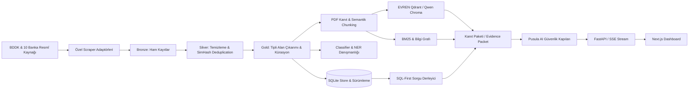

# RAGnROLL — Katılım Bankacılığı NLP ve Akıllı Karar Destek Platformu

<div align="center">

[](https://www.python.org/)
[](https://fastapi.tiangolo.com/)
[](https://nextjs.org/)
[](https://react.dev/)
[](https://docs.pytest.org/)
[](https://docs.pytest.org/)
[](https://nodejs.org/)
[](LICENSE)

**Türkiye'deki 10 resmî katılım bankasının güncel ürün, kampanya ve faizsiz finansman olanaklarını tek bir güvenli, doğrulanabilir ve açıklanabilir karar destek platformunda birleştiren uçtan uca NLP ve Hibrit RAG sistemi.**

[Özellikler](#1-öne-çıkan-ürün-özellikleri) • [Mimari](#2-sistem-ve-güvenlik-mimarisi) • [Hızlı Başlangıç](#4-hızlı-başlangıç-ve-kurulum) • [API Referansı](#5-api-ve-entegrasyon-kılavuzu) • [Kalite ve Testler](#6-kalite-güvence-test-ve-değerlendirme) • [Dokümantasyon](#9-teknik-dokümantasyon-ve-kaynaklar)

</div>

---

## 📌 İçindekiler

- [1. Öne Çıkan Ürün Özellikleri](#1-öne-çıkan-ürün-özellikleri)
- [2. Sistem ve Güvenlik Mimarisi](#2-sistem-ve-güvenlik-mimarisi)
  - [2.1 Veri ve Karar Akışı](#21-veri-ve-karar-akışı)
  - [2.2 Pusula AI — 7 Kademeli Güvenlik Hattı](#22-pusula-ai--7-kademeli-güvenlik-hattı)
  - [2.3 Çok Katmanlı Fallback ve Dayanıklılık](#23-çok-katmanlı-fallback-ve-dayanıklılık)
- [3. Teknoloji Yığını](#3-teknoloji-yığını)
- [4. Hızlı Başlangıç ve Kurulum](#4-hızlı-başlangıç-ve-kurulum)
  - [4.1 Önkoşullar](#41-önkoşullar)
  - [4.2 Yöntem A: Yerel Kurulum (Adım Adım)](#42-yöntem-a-yerel-kurulum-adım-adım)
  - [4.3 Yöntem B: Docker Compose ile Tek Komutta Başlatma](#43-yöntem-b-docker-compose-ile-tek-komutta-başlatma)
  - [4.4 Opsiyonel Bileşenler (Chroma, EVREN, DSPy/GEPA)](#44-opsiyonel-bileşenler-chroma-evren-dspygepa)
- [5. API ve Entegrasyon Kılavuzu](#5-api-ve-entegrasyon-kılavuzu)
  - [5.1 API Uç Noktaları Tablosu](#51-api-uç-noktaları-tablosu)
  - [5.2 Örnek API İstekleri ve Yanıtları](#52-örnek-api-istekleri-ve-yanıtları)
- [6. Kalite Güvence, Test ve Değerlendirme](#6-kalite-güvence-test-ve-değerlendirme)
  - [6.1 Test Kapsamı ve Güncel Sonuçlar](#61-test-kapsamı-ve-güncel-sonuçlar)
  - [6.2 Golden Set ve Regresyon Metrikleri](#62-golden-set-ve-regresyon-metrikleri)
  - [6.3 Doğrulama ve Kalite Komutları](#63-doğrulama-ve-kalite-komutları)
- [7. Depo ve Modül Mimarisi](#7-depo-ve-modül-mimarisi)
- [8. Güvenlik, Gizlilik ve Etik İlkeler](#8-güvenlik-gizlilik-ve-etik-ilkeler)
- [9. Teknik Dokümantasyon ve Kaynaklar](#9-teknik-dokümantasyon-ve-kaynaklar)

---

## 1. Öne Çıkan Ürün Özellikleri

### 🏛️ 10 Katılım Bankası Uçtan Uca Entegrasyonu
- **Tam Banka Kapsamı:** BDDK kataloğundaki 10 katılım bankasının (*Ziraat Katılım, Kuveyt Türk, Türkiye Emlak Katılım, T.O.M. Katılım, Türkiye Finans, Albaraka Türk, Dünya Katılım, Vakıf Katılım, Hayat Finans, Adil Katılım*) web kaynakları, dinamik sitemap'leri ve AJAX servisleri özel adaptörlerle taranır.
- **Kürasyonlu & Güvenilir Katalog:** Ham taranan 476 kayıt arasından ürün/finansman kanıtı taşımayan 22 belirsiz kayıt elenerek **454 doğrulanmış aktif kayıt** (`data/processed/campaigns.json`) üretim kataloğuna alınır.

### 🛡️ Pusula AI — Güvenlikli ve Kanıt Temelli Asistan
- **Halüsinasyonsuz Cevap Mimarisi:** Dil modeli (LLM) asla serbestçe finansal oran, kâr payı veya koşul uyduramaz. Sayısal gerçekler SQLite ve resmî teklif motorundan temin edilen `facts` paketine dayanır.
- **7 Kademeli Güvenlik Kapısı:** PII maskeleme (`InputGuard`), deterministik parametre doğrulaması (`PolicyValidator`), çıktı tutarlılık denetimi (`OutputGate`) ve SSE akış tekilleştirmesi (`SessionGuard`).
- **Canlı Akış (SSE Streaming):** `meta`, `delta`, `replace`, `done` olaylarıyla token bazlı akıcı cevap ve kaynak rozetleri.

### 💰 Resmî Faizsiz Finansman Hesaplama Motoru
- **4 Finansman Kategorisi:** *İhtiyaç*, *Taşıt*, *Konut* ve *Ticari/KOBİ* finansmanları için resmî banka kaynaklı kâr payı oranları ve vade sınırlarıyla dinamik taksit, toplam geri ödeme ve masraf hesaplaması.
- **Şeffaf Karşılaştırma:** Kullanıcının tutar, vade ve masraf önceliğine göre objektif sıralama; sübjektif "en iyi banka" yönlendirmesi yapılmaz.

### 📚 Hibrit RAG & Resmî PDF Standartları Kütüphanesi
- **TKBB & AAOIFI Standartları:** Faizsiz Finans Standartları, Muhasebe Standartları ve Faaliyet Raporlarından oluşan **5 resmî dokümanın 2.602 sayfası** taranarak 2.509 sayfa kökenli kanıt parçası çıkarılmıştır.
- **Hibrit Füzyon (RRF):** EVREN Qdrant (`bge-m3-embed`) veya yerel Chroma (`Qwen3-Embedding-0.6B`), BM25 kelime araması ve 2 adımlı Bilgi Grafı (Knowledge Graph) Reciprocal Rank Fusion ile birleştirilir.

### 📊 Modern Next.js 16.3 Web Dashboard
- **Ana Sayfa:** Dağılım grafikleri, özet sayaçlar ve güncel kampanyalar.
- **Karşılaştırma:** Tutar/vade simülasyonu, finansman türleri ve interaktif Plotly grafikleri.
- **Kampanya Merkezi:** Dinamik filtreler, arama, kanıt aralıkları ve detay kartları.
- **Pusula AI Sohbet:** Güvenli düşünme adımları, kaynak kartları ve çok turlu netleştirme arayüzü.

---

## 2. Sistem ve Güvenlik Mimarisi

### 2.1 Veri ve Karar Akışı



### 2.2 Pusula AI — 7 Kademeli Güvenlik Hattı

```text
                  ┌────────────┐
                  │ InputGuard │  <-- PII Maskeleme (TCKN/IBAN), Injection Engelleme,
                  └─────┬──────┘      İşlem/Şikâyet Erken Yönlendirmesi (REDIRECT)
                        │
                        ▼
                ┌───────────────┐
                │ PolicyPlanner │ <-- LLM veya Deterministik Niyet & Slot Planı
                └───────┬───────┘
                        │
                        ▼
               ┌─────────────────┐
               │ PolicyValidator │ <-- Parametre Sınırları (Vade 1-240 ay, Tutar max 100M TL),
               └────────┬────────┘     İzinli Araç Listesi ve Fail-Closed Doğrulama
                        │
         ┌──────────────┼──────────────┐
         ▼              ▼              ▼
     [ANSWER]       [CLARIFY]       [REFUSE]
         │              │              │
         ▼              │              │
┌──────────────────┐    │              │
│ ToolOrchestrator │    │              │  <-- SQL, Hybrid RAG, Finansman Teklif Motoru
└────────┬─────────┘    │              │
         ▼              │              │
┌──────────────────┐    │              │
│ AnswerGenerator  │    │              │  <-- Yalnızca Doğrulanmış Facts & Sources ile Üretim
└────────┬─────────┘    │              │
         ▼              │              │
   ┌────────────┐       │              │
   │ OutputGate │       │              │  <-- Sayısal/Oran Denetimi, Halüsinasyon ve Tekrar Filtresi,
   └─────┬──────┘       │              │      Başarısızlıkta Deterministik Onarım / Fallback
         │              │              │
         └──────────────┼──────────────┘
                        │
                        ▼
             ┌─────────────────────┐
             │ PresentationAdapter │ <-- Dahili [K#] Kodlarını Temizleme, Kaynak Rozetleri
             └──────────┬──────────┘
                        │
                        ▼
                ┌──────────────┐
                │ SessionGuard │         <-- Monoton eventId ile SSE Tekilleştirme
                └──────────────┘
```

### 2.3 Çok Katmanlı Fallback ve Dayanıklılık

Sistem harici servis kesintilerine karşı 3 seviyeli koruma içerir:
1. **Üretim Hattı (Generation):** `EVREN API` $\rightarrow$ `Yerel vLLM / Gemma` $\rightarrow$ `Deterministik Kural Şablonu`
2. **Arama Hattı (Retrieval):** `EVREN Qdrant (bge-m3)` $\rightarrow$ `Yerel Chroma (Qwen3-Embedding)` $\rightarrow$ `BM25 & Bilgi Grafı`
3. **Circuit Breaker:** Servis bazında arıza sayaçları izlenir; arızalanan bileşen izole edilerek diğer akışların durması engellenir.

---

## 3. Teknoloji Yığını

| Katman | Teknoloji / Kütüphane | Sürüm | Kullanım Amacı |
| :--- | :--- | :--- | :--- |
| **Backend & API** | Python, FastAPI, Pydantic | Python 3.11, FastAPI 0.115, Pydantic v2.9 | Tip güvenli REST API, SSE akışı ve asistan orkestrasyonu |
| **Sunucu** | Uvicorn | 0.30 | Yüksek verimli asenkron ASGI sunucusu |
| **Veritabanı** | SQLite | 3.x | Sürüm geçmişli, ilişkisel ve hızlı yerel veri depolama |
| **Web Kazıma** | Requests, BeautifulSoup4, truststore | 2.32, 4.12 | Banka adaptörleri, TLS güven zinciri ve HTML ayrıştırma |
| **PDF & OCR** | PyMuPDF (fitz), RapidOCR, pypdf | 1.24, 0.9 | TKBB/AAOIFI standartlarından sayfa kökenli metin ve OCR çıkarma |
| **NLP & ML** | spaCy, scikit-learn, joblib | spaCy 3.8.16, sklearn 1.9.0, joblib 1.5.3 | Türkçe NER, çok etiketli sınıflandırıcı ve runtime manifest |
| **Vektör & Arama**| ChromaDB, Qdrant Client, BM25 | Chroma 1.0, Qdrant 1.19, rank-bm25 | Hibrit arama, yerel/uzak vektör koleksiyonları ve RRF |
| **Embedding** | Qwen3-Embedding-0.6B, BGE-M3 | Transformers 4.44 / EVREN API | 1024 boyutlu yerel ve çok dilli uzak yoğun vektör üretimi |
| **LLM Motoru** | EVREN llm-fast, vLLM / OpenAI API | Gemma-2 / Qwen Uyumlu | Kanıta bağlı Türkçe asistan üretimi |
| **Prompt Opt.** | DSPy, GEPA | DSPy 3.3.1, GEPA 0.1.4 | Çevrimdışı ölçülebilir Türkçe prompt optimizasyonu |
| **Frontend** | Next.js, React, TypeScript | Next.js 16.3 (Turbopack), React 19.2, TS 5 | Modern, responsive ve erişilebilir web dashboard'u |
| **Grafik / UI** | Plotly.js, Lucide Icons | Plotly 3.7 | Finansman simülasyonu ve kampanya dağılım grafikleri |
| **Test & QA** | pytest, pytest-cov, Node Test Runner, flake8 | pytest 8.3, Node 22 | 912 backend testi (%88 coverage), 39 UI testi, 0 lint hatası |
| **Konteyner** | Docker, Docker Compose | Alpine Tabanlı Çok Aşamalı | İzole, rootless ve tekrarlanabilir dağıtım sözleşmesi |

---

## 4. Hızlı Başlangıç ve Kurulum

### 4.1 Önkoşullar
- **Python:** `3.11`
- **Node.js:** `20+` veya `22 LTS`, `npm`
- **İsteğe Bağlı:** Docker Desktop / Docker Engine & Compose

Sistem gereksinimlerinizi doğrulayın:
```bash
python3 --version
node --version
npm --version
```

---

### 4.2 Yöntem A: Yerel Kurulum (Adım Adım)

#### 1. Depoyu Klonlayın ve Sanal Ortamı Oluşturun

**macOS / Linux:**
```bash
git clone https://github.com/rag-n-roll/RAGnROLL-katilim-bankaciligi-nlp.git
cd RAGnROLL-katilim-bankaciligi-nlp
python3.11 -m venv .venv
source .venv/bin/activate
```

**Windows PowerShell:**
```powershell
git clone https://github.com/rag-n-roll/RAGnROLL-katilim-bankaciligi-nlp.git
cd RAGnROLL-katilim-bankaciligi-nlp
py -3.11 -m venv .venv
.\.venv\Scripts\Activate.ps1
```

#### 2. Bağımlılıkları Yükleyin

```bash
# Python backend bağımlılıkları
python -m pip install --upgrade pip
python -m pip install -r requirements.txt

# Next.js frontend bağımlılıkları
cd src/dashboard
npm ci
cd ../..

# Çevre değişkenlerini hazırlayın
cp .env.example .env
```

#### 3. Servisleri Başlatın

**Terminal 1 — FastAPI Backend:**
```bash
python -m uvicorn src.main:app --reload --env-file .env --port 8000
```
- API Sağlık Ucu: [http://localhost:8000/api/v1/health](http://localhost:8000/api/v1/health)
- Swagger / OpenAPI: [http://localhost:8000/docs](http://localhost:8000/docs)

**Terminal 2 — Next.js Web Dashboard:**
```bash
cd src/dashboard
npm run dev
```
- Web Dashboard Arayüzü: [http://localhost:3000](http://localhost:3000)

---

### 4.3 Yöntem B: Docker Compose ile Tek Komutta Başlatma

Tüm platformu (Backend API, SQLite, Chroma ve Next.js Dashboard) konteyner içinde başlatmak için:

**macOS / Linux:**
```bash
docker compose up --build --detach
curl --fail http://localhost:8000/api/v1/health
curl --fail http://localhost:3000/
```

**Windows PowerShell:**
```powershell
docker compose up --build --detach
Invoke-RestMethod http://localhost:8000/api/v1/health
Invoke-RestMethod http://localhost:3000/
```

Durdurmak ve kaynakları korumak için:
```bash
docker compose down --remove-orphans
```

---

### 4.4 Opsiyonel Bileşenler (Chroma, EVREN, DSPy/GEPA)

#### Yerel Chroma Vektör İndeksini Oluşturma (Qwen3-Embedding)
```bash
python -m scripts.ingest_chroma --batch-size 64
```
*İlk çalıştırmada `Qwen/Qwen3-Embedding-0.6B` modelini indirir ve verileri indeksler. Sonraki çalıştırmalarda yalnızca değişen içerikler artımlı (incremental) güncellenir.*

#### EVREN API Entegrasyonu
`.env` dosyasında anahtarlarınızı tanımlayın:
```env
EVREN_LLM_API_KEY=your_evren_llm_key
EVREN_EMBEDDING_API_KEY=your_evren_embed_key
EVREN_QDRANT_API_KEY=your_evren_qdrant_key
EVREN_TEAM_PREFIX=your_team_name
```

#### DSPy / GEPA Prompt Optimizasyonu Sözleşme Kontrolü
```bash
python -m pip install -r requirements-prompt-optimization.txt
python -m src.prompt_optimization.optimize_gepa --check
```

---

## 5. API ve Entegrasyon Kılavuzu

### 5.1 API Uç Noktaları Tablosu

Tüm versiyonlu endpoint'ler `/api/v1` öneki altında çalışır:

| Yöntem | Endpoint | Görev / Açıklama |
| :--- | :--- | :--- |
| `GET` | `/api/v1/health` | Veritabanı, şema ve API sağlık durumu |
| `GET` | `/api/v1/dashboard/summary` | Banka, kampanya, ürün ve aktif kayıt sayaçları |
| `GET` | `/api/v1/dashboard/snapshot` | Dashboard için tek istekte dağılım ve özet paketi |
| `GET` | `/api/v1/banks` | 10 katılım bankası listesi ve aktif kayıt sayıları |
| `GET` | `/api/v1/campaigns` | Filtrelenebilir, aranabilir ve sayfalı kampanya listesi |
| `GET` | `/api/v1/filters` | Banka, ürün tipi ve para birimi filtre seçenekleri |
| `GET` | `/api/v1/campaigns/{id}` | Kampanya detayları, tipli alanlar ve kanıt aralıkları |
| `GET` | `/api/v1/campaigns/{id}/versions` | Kampanyanın geçmiş sürümleri ve değişim takibi |
| `POST`| `/api/v1/comparisons` | Kampanyalar arası kriter tabanlı karşılaştırma |
| `GET` | `/api/v1/financing-campaigns` | Bankaların faizsiz finansman kampanyaları kataloğu |
| `POST`| `/api/v1/financing-quotes` | Resmî oranlarla anlık faizsiz finansman teklifi hesaplama |
| `POST`| `/api/v1/extract` | Ham metinden kural ve model tabanlı tipli alan çıkarımı |
| `POST`| `/api/v1/query/compile` | Doğal dil sorusunu intent, slot, filtre ve SQL planına derleme |
| `POST`| `/api/v1/chat` | Pusula AI tek parça doğrulanmış cevap üretimi |
| `POST`| `/api/v1/chat/stream` | Pusula AI SSE canlı akışlı cevap üretimi |
| `GET` | `/api/v1/llm/status` | Aktif LLM sağlayıcısı ve fallback durumu |
| `GET` | `/api/v1/capabilities/status` | Sistem yetenekleri ve circuit breaker durumları |
| `POST`| `/api/v1/data-refresh` | Kontrollü asenkron veri yenileme işi başlatma |
| `GET` | `/api/v1/data-refresh/{job_id}`| Yenileme, NLP zenginleştirme ve indeksleme iş takibi |

---

### 5.2 Örnek API İstekleri ve Yanıtları

#### 1. Resmî Faizsiz Finansman Teklifi Hesaplama (`POST /api/v1/financing-quotes`)

**İstek:**
```bash
curl -X POST http://localhost:8000/api/v1/financing-quotes \
  -H "Content-Type: application/json" \
  -d '{
    "financing_type": "vehicle",
    "amount": 500000,
    "term_months": 36,
    "fee_priority": "low_fee"
  }'
```

**Başarılı Yanıt (Özet):**
```json
{
  "total_quotes": 6,
  "eligible_quotes": [
    {
      "bank_name": "Kuveyt Türk Katılım Bankası A.Ş.",
      "product_name": "Araç Finansmanı",
      "profit_share_rate": 0.0389,
      "term_months": 36,
      "amount": 500000.0,
      "monthly_installment": 28412.54,
      "total_payment": 1022851.44,
      "allocated_fee": 2875.0,
      "annual_cost_rate": 0.6214,
      "source_url": "https://www.kuveytturk.com.tr/bireysel/finansmanlar/arac-finansmani",
      "official_verified": true
    }
  ]
}
```

#### 2. Pusula AI Canlı Sohbet Akışı (`POST /api/v1/chat/stream`)

**İstek:**
```bash
curl -N -X POST http://localhost:8000/api/v1/chat/stream \
  -H "Content-Type: application/json" \
  -d '{
    "message": "Kuveyt Türkün güncel konut finansmanı şartları ve oranları nelerdir?"
  }'
```

**SSE Akış Formatı:**
```text
event: meta
data: {"request_id":"req_abc123","intent":"product_search","facts_count":3,"sources":[{"title":"Kuveyt Türk Konut Finansmanı","url":"https://...","kind":"official_web"}]}

event: delta
data: {"text":"Kuveyt Türk, konut finansmanında 120 aya varan vade seçenekleri sunmaktadır..."}

event: done
data: {"status":"completed","generation_mode":"grounded"}
```

---

## 6. Kalite Güvence, Test ve Değerlendirme

### 6.1 Test Kapsamı ve Güncel Sonuçlar

Platform, CI/CD süreçlerinde sıkı kalite eşiklerine (`configs/quality_thresholds.json`) tabidir:

| Ölçüt | Hedef Eşik | Gerçekleşen Sonuç | Durum |
| :--- | ---: | ---: | :---: |
| **Backend Pytest Paketi** | — | **912 Passed (69 Dosya)** | ✅ Başarılı |
| **Backend Kod Kapsamı (Coverage)** | $\ge \%70$ | **%88 (10.375 İfade)** | ✅ Başarılı |
| **Frontend Dashboard Testleri** | — | **39 Passed (Node Test)** | ✅ Başarılı |
| **Flake8 Python Kod Standartları** | 0 Hata | **0 Hata** | ✅ Başarılı |
| **Next.js Production Build** | 0 Hata | **Derleme Başarılı** | ✅ Başarılı |

---

### 6.2 Golden Set ve Regresyon Metrikleri

500 dondurulmuş değerlendirme kaydı (`data/model_training_data/golden_evaluation_set.jsonl`) üzerinde ölçülen güncel performans:

```text
Intent Doğruluğu (Exact Match)     : %99,44 (179 / 180 Doğru)  [Eşik: %85,0]
Desteklenen Alan Çıkarımı Doğruluğu : %97,32 (436 / 448 Doğru)  [Eşik: %82,0]
Sorgu Hata Oranı                   : %0,00                      [Eşik: <= %1,0]
```

- **Çok Turlu Diyalog Zincirleri:** 100 konuşma senaryosu (`tests/test_conversational_chains_100.py`) kriter koruma ve konu değişimi testlerini %100 geçer.
- **Stres ve Güvenlik Benchmark'ı:** 150 uç durum sorgusu (`data/model_training_data/stress_benchmark_150.jsonl`) rota ve güvenlik kapısı doğrulamalarından geçer.

---

### 6.3 Doğrulama ve Kalite Komutları

Tüm testleri ve kod kontrollerini yerel ortamda çalıştırmak için:

```bash
# 1. Backend testleri ve test kapsamı (Coverage)
python -m pytest tests -q --cov=src --cov-report=term --cov-fail-under=70

# 2. Kod stili denetimi (Flake8)
python -m flake8 src tests --max-line-length=100 --extend-ignore=E203 --exclude=src/dashboard/node_modules

# 3. Golden Set değerlendirmesi
python -m src.evaluation.golden data/model_training_data/golden_evaluation_set.jsonl

# 4. Frontend testleri, lint ve build
cd src/dashboard
npm test
npm run lint
npm run build
cd ../..
```

---

## 7. Depo ve Modül Mimarisi

```text
RAGnROLL-katilim-bankaciligi-nlp/
├── .github/workflows/          # CI/CD: backend, dashboard ve container iş akışları
├── configs/                    # Kalite eşikleri, sorgu kuralları ve prompt şablonları
├── data/
│   ├── archived/               # 232 süresi geçmiş / arşivlenmiş kampanya kaydı
│   ├── model_training_data/    # Sınıflandırıcı, NER, prompt, konuşma ve golden set verileri
│   ├── ontology/               # Katılım finans ontolojisi, alias sözlüğü ve bilgi grafı
│   ├── processed/              # 454 doğrulanmış aktif kampanya snapshot'ı
│   ├── raw/                    # 10 bankanın ham çekim verileri
│   ├── source_documents/       # 5 resmî PDF belgesi, sayfa manifestleri ve 2.509 kanıt parçası
│   └── terminology/            # Terim sözlüğü ve ilişkisel kavram şemaları
├── docs/                       # Mimari, API, model değerlendirme, runbook ve tasarım belgeleri
├── models/
│   ├── model_manifest.json     # Model versiyon ve hash manifesti
│   └── final_training/         # Eğitilmiş classifier.joblib ve spaCy NER modelleri
├── prompts/                    # Canlı asistan için grounded_answer.json promptları
├── scripts/                    # Veri yenileme, indeksleme, benchmark ve test araçları
├── src/
│   ├── annotation/             # Kampanya veri etiketleme ve taksonomi arayüzü
│   ├── api/                    # FastAPI endpoint'leri, schemas.py ve routing
│   ├── campaign_catalog.py     # Doğrulanmış aktif kampanya kürasyon kuralları
│   ├── classifier/             # Çok etiketli kampanya sınıflandırıcı eğitim ve çıkarım
│   ├── comparison/             # Tarafsız ve sözleşmeli karşılaştırma motoru
│   ├── dashboard/              # Next.js 16.3 + React 19 web dashboard uygulaması
│   ├── data_quality/           # Tekilleştirme (deduplication) ve SimHash yönetimi
│   ├── evaluation/             # Golden set, query routing ve değerlendirme raporlama
│   ├── extraction/             # Tipli alan çıkarım motoru ve hibrit çıkarıcı
│   ├── financing/              # Resmî banka teklif kaynakları ve finansman hesaplayıcısı
│   ├── ingestion/              # PDF kanıt çıkarma, sayfa hash ve doğrulama hattı
│   ├── intent/                 # Kural ve model tabanlı niyet tespit motoru
│   ├── knowledge/              # Terminoloji ve alias dönüştürücü servis
│   ├── llm/                    # EVREN, OpenAI/vLLM istemcileri, karar ve judging motoru
│   ├── ner/                    # Türkçe spaCy NER veri hazırlama ve eğitim hattı
│   ├── nlp_runtime/            # Model artefakt bütünlük denetimi ve runtime advisory
│   ├── normalization/          # Sayı, tarih ve para birimi normalizasyonu
│   ├── observability/          # EventRecorder ve metrik izleme altyapısı
│   ├── persistence/            # SQLite CampaignStore ve dashboard veri servisi
│   ├── policy/                 # InputGuard, PolicyValidator, OutputGate, PresentationAdapter
│   ├── preprocessing/          # Metin temizleme, tokenizasyon ve Türkçe normalizasyon
│   ├── prompt_optimization/    # DSPy ve GEPA çevrimdışı prompt optimizasyonu
│   ├── prompting/              # DSPy program tanımları
│   ├── providers/              # Circuit breaker ve dayanıklılık (resilience) katmanı
│   ├── query/                  # Doğal dilden SQL ve kural tabanlı sorgu derleyicisi
│   ├── retrieval/              # Qdrant, Chroma, BM25, Knowledge Graph ve RRF füzyonu
│   ├── scraper/                # BDDK listesi ve 10 bankaya özel web kazıma adaptörleri
│   ├── services/               # GroundedAssistant, ConversationService ve orkestrasyon
│   ├── training/               # Birleşik split oluşturma ve eğitim veri sözleşmesi
│   └── utils/                  # Ortak konfigürasyon ve yardımcı fonksiyonlar
├── tests/                      # 69 dosyadan oluşan 912 testlik kapsamlı backend test paketi
├── Dockerfile                  # API üretim konteyner tanımı
├── docker-compose.yml          # Çoklu servis (API + Dashboard + Volumes) orkestrasyonu
├── requirements.txt            # Temel Python bağımlılıkları
├── requirements-prompt-optimization.txt # DSPy ve GEPA bağımlılıkları
└── README.md                   # Proje ana tanıtım ve başlangıç rehberi
```

---

## 8. Güvenlik, Gizlilik ve Etik İlkeler

1. **Kişisel Veri (PII) Korunması:** Kullanıcıdan asla TCKN, kart numarası, şifre veya hesap detayı istenmez. Girdide saptanan hassas desenler maskelenir veya istek reddedilir (`REFUSE`).
2. **Yetkisiz İşlem Sınırlandırması:** Sistem bir bankacılık işlem kanalı değildir. Para transferi, finansman başvurusu veya şikâyet açma talepleri simüle edilmez; doğrudan resmî banka kanallarına güvenli yönlendirme (`REDIRECT`) yapılır.
3. **Objektif ve Şeffaf Sıralama:** Hiçbir bankaya sponsorlu veya yapay öncelik verilmez. Finansman sıralamaları kullanıcının belirlediği kâr payı, vade ve masraf ölçütlerine göre tarafsızca listelenir.
4. **Resmî Kanıt Kökeni:** Her cevabın altında ilgili bankanın web bağlantısı veya resmî PDF standart belgesinin sayfa numarası referans olarak sunulur.

---

## 9. Teknik Dokümantasyon ve Kaynaklar

Daha ayrıntılı mimari, veri sözleşmesi ve operasyonel bilgiler için `docs/` dizinindeki teknik kılavuzları inceleyebilirsiniz:

- 📐 **[Sistem Mimarisi Dokümanı](docs/architecture.md)** — Katmanlı mimari, RAG ve veri akışı.
- 📋 **[Veri Sözleşmesi (Data Contract)](docs/data-contract.md)** — Tipli alan çıkarım şeması ve durum kodları.
- 🔌 **[API Başvuru Rehberi](docs/api.md)** — Endpoint sözleşmeleri, SSE akışı ve parametreler.
- 🧪 **[Model ve Değerlendirme Raporu](docs/model-evaluation-report.md)** — Model metrikleri, NER ve sınıflandırıcı analizi.
- 🛠️ **[Operasyonel Çalıştırma Rehberi (Runbook)](docs/runbook.md)** — Konteyner yönetimi, veri yenileme ve bakım adımları.
- 🎯 **[Prompt Optimizasyon Kılavuzu](docs/prompt-optimization.md)** — DSPy ve GEPA deney sözleşmesi.

---

## 📄 Lisans

Bu proje [Apache License 2.0](LICENSE) kapsamında lisanslanmıştır. Detaylar için `LICENSE` dosyasını inceleyiniz.